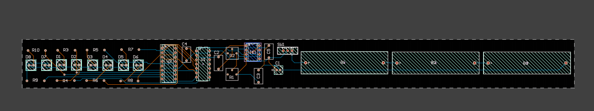
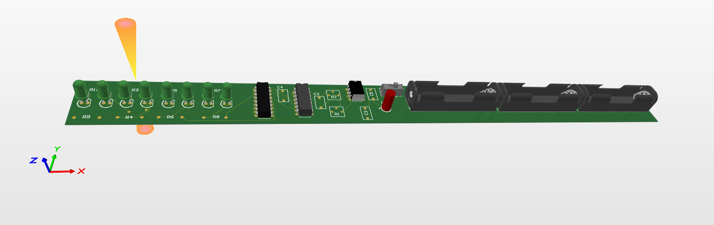

# LED Chaser Wand

This repository contains the files and documentation for the **LED Chaser Wand** project. The wand is powered by a 3 AA batteries and uses a 555 timer, SN74H counter, and CD74HC138 decoder to create a chaser effect with 8 LEDs arranged on a PCB shaped like a wand.

## Project Overview

### Components Used
- **Power Source:** 3x AA batteries
- **Clock Generator:** 555 Timer IC with adjustable frequency
- **Counter:** SN74H (4-bit counter using only 3 bits)
- **Decoder:** CD74HC138
- **LEDs:** 8 standard LEDs
- **PCB:** Custom designed in the shape of a wand

### Circuit Design
- The 555 timer is configured to generate a clock pulse with adjustable frequency, controlled by two variable resistors.
- A 47µF 25V capacitor is used at the power supply output to filter noise, ensuring smooth operation.
- The SN74H counter increments with each clock pulse, but only the first 3 bits are used to make the LED chaser animation visible.
- The CD74HC138 decoder takes the 3-bit counter output and drives one of the 8 LEDs in sequence, creating the chaser effect.
- Each IC has its own filter capacitor on its power input to stabilize the voltage and reduce noise.
- The schematic uses labels extensively to keep the design neat and easy to follow.
- Finally all leds have a current limiting resistor 100ohm for protection purposes.

## Project Files

### Hardware
- *2d_pcb.png* and *3d_pcb.png* : Layout of the PCB designed for the project.
- *schematic.png* : Circuit schematic showing the connections between components.

### Schematic

## Assembly Instructions
1. **Assemble the Circuit:** Follow the schematic in *Schematic.png* to solder components onto the PCB.
2. **Power the Wand:** Insert the AA battery to power the circuit.
3. **Enjoy the Effect:** Watch as the LEDs create a chaser effect.

### Design

## License
This project is licensed under the MIT License. See the *LICENSE* file for more details.

## Contribution
Feel free to fork this repository and contribute by submitting issues or pull requests.

## Contact
For any questions or suggestions, please contact [Prakhar](https://github.com/prax-1) at [Email](prakhargupta1811@gmail.com).
